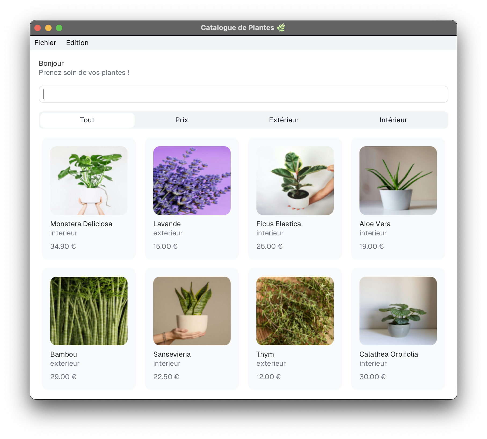
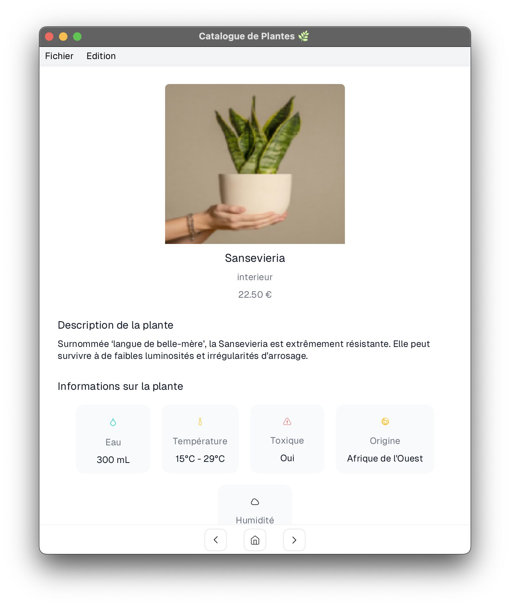

# Planta 🌿

A modern JavaFX application for managing your personal plant collection with an intuitive interface and comprehensive plant care information.

<div align="center">
  
  
  
</div>

## Overview

**Planta** is a desktop application built with JavaFX that helps plant enthusiasts organize and track their plant collections. Whether you're managing indoor houseplants or outdoor garden varieties, Planta provides a clean, user-friendly interface to catalog your plants with detailed care requirements, pricing, and environmental needs.

The application features a visual catalog view with filtering and search capabilities, making it easy to find and manage plants in your collection. Each plant entry includes comprehensive information such as water requirements, temperature ranges, humidity levels, toxicity warnings, and origin details.

## Features

- **Visual Plant Catalog**: Browse your collection in an attractive grid layout with plant images
- **Smart Filtering**: Filter plants by type (indoor/outdoor) or sort by price
- **Real-time Search**: Quickly find plants by name with instant search results
- **Detailed Plant Information**: Track comprehensive care requirements including:
  - Water needs (ml per watering)
  - Temperature range (°C)
  - Humidity requirements (%)
  - Toxicity information
  - Origin and description
  - Pricing
- **Add & Edit Plants**: Easily add new plants or modify existing entries with custom images
- **Data Persistence**: Save and load your collection using JSON format
- **Default Data**: Automatically loads sample plant data on first launch

## Technical Highlights

### Challenges & Solutions

1. **JavaFX Integration**: Implementing a modern UI with JavaFX required careful attention to FXML layouts and controller bindings to ensure smooth data flow between the model and view layers.

2. **Image Handling**: Supporting both local file paths and remote URLs for plant images required implementing a flexible image loading system that gracefully handles different image sources.

3. **Data Serialization**: Using Gson for JSON serialization while maintaining JavaFX's `ObservableList` functionality required custom handling to ensure the UI updates reactively when data changes.

4. **Resource Management**: Properly packaging resources (images, FXML files, JSON data) to work both in development and as a compiled JAR required careful path configuration.

5. **Type-safe Filtering**: Implementing dynamic filtering that combines search text with category filters while maintaining type safety and performance.

### Libraries & Technologies

- **JavaFX 17.0.11**: UI framework for building the desktop interface
  - `javafx.controls`: Core UI components
  - `javafx.fxml`: Declarative UI layout
- **Gson 2.10.1**: JSON serialization and deserialization
- **Java 21**: Modern Java features including records and pattern matching

### Project Structure

```
Planta/
├── src/
│   ├── planta/
│   │   ├── Main.java                    # Application entry point
│   │   ├── controle/
│   │   │   ├── ControleCatalogue.java   # Catalog view controller
│   │   │   ├── ControleCarte.java       # Plant card component
│   │   │   └── ControlePlante.java      # Plant detail controller
│   │   ├── modele/
│   │   │   ├── Catalogue.java           # Plant collection model
│   │   │   ├── Plante.java              # Plant entity
│   │   │   ├── TypePlante.java          # Plant type enum
│   │   │   └── CacheImage.java          # Image caching utility
│   │   ├── vue/
│   │   │   ├── Loader.java              # Scene loader utility
│   │   │   └── DialoguePlante.java      # Plant edit dialog
│   │   └── exceptions/
│   │       └── PlantaException.java     # Custom exception handling
│   ├── fxml/                            # FXML layout files
│   ├── images/                          # Default plant images
│   └── planta.json                      # Sample plant data
└── README.md
```

## Getting Started

### Prerequisites

- **Java 21** or higher
- **JavaFX SDK 17.0.11**

### Installation

1. Download the latest `Planta.jar` from the [Releases](https://github.com/ayoubdlf/Planta/releases) page
2. Download JavaFX SDK 17.0.11 from [openjfx.io](https://openjfx.io/)
3. Extract the JavaFX SDK to a location on your system

### Running the Application

Execute the following command, replacing `[javafx-sdk-17.0.11/lib]` with the actual path to your JavaFX SDK lib folder:

```bash
java --module-path [javafx-sdk-17.0.11/lib] --add-modules javafx.controls,javafx.fxml -jar Planta.jar
```

**Example:**
```bash
java --module-path /Users/username/javafx-sdk-17.0.11/lib --add-modules javafx.controls,javafx.fxml -jar Planta.jar
```

### Building from Source

If you want to build the project yourself:

1. Clone the repository
2. Ensure you have Java 21 and JavaFX SDK installed
3. Build the project using your IDE (IntelliJ IDEA recommended)
4. Export as JAR with dependencies

## Usage

### First Launch

On first launch, Planta automatically loads sample plant data from `planta.json`, giving you a starting collection to explore.

### Managing Your Collection

- **Browse**: View all plants in the main catalog
- **Search**: Type in the search bar to filter plants by name
- **Filter**: Use the filter buttons to show only indoor plants, outdoor plants, or sort by price
- **Add Plant**: Click the "Ajouter" button to add a new plant with custom details
- **Edit Plant**: Click on any plant card to view and edit its information
- **Delete Plant**: Remove plants from the detail view
- **Save/Load**: Use the "Sauvegarder" and "Charger" buttons to export/import your collection as JSON

## Data Format

Plant data is stored in JSON format. Here's an example entry:

```json
{
  "nom": "Monstera Deliciosa",
  "description": "Plante tropicale au feuillage spectaculaire...",
  "image": "https://images.unsplash.com/photo-1614594975525-e45190c55d0b",
  "origine": "Amérique Centrale",
  "type": "INTERIEUR",
  "prix": 34.9,
  "eau": 600,
  "temperature": [18, 28],
  "humidite": [60, 80],
  "estToxique": true
}
```